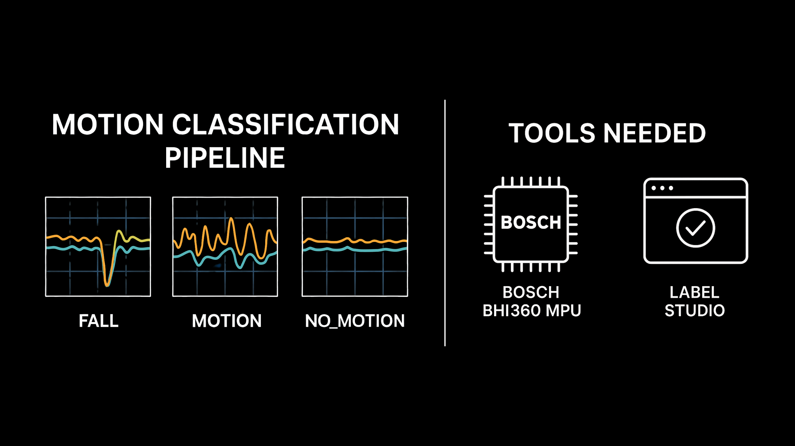

<p align="center">
  
</p>

# 🧠 Embedded Fall Detection Pipeline with Wrist-Worn IMU Data

This project implements a complete, embedded-ready pipeline for **human activity recognition and fall detection** using wrist-mounted **Bosch BHI360** sensor data. Developed as part of a master's thesis, it demonstrates the feasibility of deploying machine learning models entirely **on-device**, on ultra-low-power hardware, without the need for external computation or connectivity.

---

## 🔍 Overview

Falls are a major cause of injury and hospitalization among older adults. Detecting them early using wearables can enable faster intervention, improve safety, and reduce healthcare costs. However, many machine learning solutions are too resource-hungry for deployment on microcontrollers.

This project bridges that gap by combining:

- 🎯 Accurate **fall detection using inertial signals**
- ⚙️ Lightweight, efficient **decision tree models**
- 🔧 Real-time **on-device inference** using embedded firmware
- 📉 Evaluation via **Leave-One-Session-Out Cross-Validation**
- 🧠 Feature-rich yet embedded-compatible model engineering

---

## 🧾 Data Collection Info

- 📦 **Sensor:** Bosch BHI360 Shuttle Board  
- 🧠 **Firmware:** `Bosch_Shuttle3_BHI360_BMM150.fw`  
- 📈 **Sensor Configuration:**
  - Accelerometer (Corrected, Non-Wakeup) at **200 Hz**
  - Gyroscope (Corrected, Non-Wakeup) at **200 Hz**

Data was logged as JSON and then processed using this notebook for machine learning.

---

## 📁 Files & Structure

- `app.ipynb` – Main Jupyter notebook for preprocessing, training, evaluation
- `training_data.csv` – Final training-ready dataset with session IDs

---

## 🛠️ Label Studio Setup

Use this config when importing time series data into Label Studio:

```xml
<View>
  <TimeSeriesLabels name="tsLabels" toName="ts">
    <Label value="FALL" background="red"/>
    <Label value="MOTION" background="#ffea00"/>
    <Label value="NO MOTION" background="#05ff16"/>
  </TimeSeriesLabels>

  <TimeSeries name="ts" valueType="json" value="$tsData" timeColumn="timestamp_s" ordered="true">
    <Channel column="accel_x" legend="accel_x"/>
    <Channel column="accel_y" legend="accel_y"/>
    <Channel column="accel_z" legend="accel_z"/>
    <Channel column="gyro_x" legend="gyro_x"/>
    <Channel column="gyro_y" legend="gyro_y"/>
    <Channel column="gyro_z" legend="gyro_z"/>
  </TimeSeries>
</View>
```

---

## 📦 Pipeline Components

### ✅ Label Parsing & Preprocessing
- Raw IMU (accelerometer + gyroscope) data collected at **200 Hz**
- JSON logs parsed and restructured into consistent time-series frames
- Corrupted or incomplete samples removed
- Labels merged from **Label Studio** annotations using session timestamps

### 📊 Feature Extraction
- Extracted from **2-second windows** with **0.25-second hops**
- Includes:
  - Time-domain features (mean, variance, skewness, kurtosis, range, percentiles)
  - Frequency-domain features (FFT energy, dominant frequency index)
  - Custom heuristics (impact peak, jerk magnitude, signal magnitude area, time to peak)

### ⚙️ Data Augmentation + Balancing
- Class imbalance addressed using **SMOTE**
- Optional augmentation for rare event simulation

### 🤖 Model Training
- Two classifiers compared:
  - `HistGradientBoostingClassifier` – high-performing, but too large for embedded use
  - `DecisionTreeClassifier` – slightly lower accuracy, but fits into embedded memory
- Trained using **Leave-One-Session-Out (LOSO) cross-validation** to test generalization

### 📈 Evaluation
- Reports:
  - Per-class precision, recall, F1
  - Overall macro scores
- Includes:
  - Confusion matrices
  - Metric plots

---

## 🔌 Firmware Deployment

The trained `DecisionTreeClassifier` was exported to C using [`m2cgen`](https://github.com/BayesWitnesses/m2cgen) and embedded into the BHI360 firmware.

Key integration steps:
- `model.c` and `model.h` inserted under `libs/my_classifier/`
- Wrapper function created to expose inference to SDK
- Custom virtual driver `VirtMyClassifier` written to invoke the model
- Registered under:
  - `boards/Bosch_Shuttle3_BHI360_MyModel.cfg`
  - `common/config.7189_di03_rtos_bhi360.cmake`
- Final firmware image:  
  `release/gccfw/Bosch_Shuttle3_BHI360_MyModel.fw`

Flashing can be done via **Bosch Development Desktop 2.0**.

More details about firmware deployment in the README file under the SDK folder. 

---

## 🧾 Data Collection Info

- 👤 **Subject:** One healthy adult, 30 sessions
- 📍 **Placement:** Left wrist (taped securely)
- 📈 **Sampling:** 200 Hz (accelerometer + gyroscope)
- 🧠 **Sensor Platform:** Bosch Shuttle Board 3.0 + Application Board 3.1
- 🔌 **Firmware Used for Collection:** `Bosch_Shuttle3_BHI360_BMM150.fw`

Each session includes:
- Static idle
- General arm motion
- Sit-to-stand and stand-to-sit transitions
- Simulated forward, backward, and lateral falls

---

## 🚀 Reproducibility
To replicate the results:
- Record inertial data with the BHI360 at 200 Hz.
- Annotate using Label Studio and the template above.
- Run app.ipynb to preprocess, extract features, and train models.
- Use m2cgen to export the selected model to C.
- Integrate the C code into the SDK and build the firmware.
- Flash Bosch_Shuttle3_BHI360_MyModel.fw using Bosch Desktop 2.0

## 📣 Acknowledgements
This project was built using Bosch Sensortec hardware and SDK, with thanks to the open-source ML community for tools like scikit-learn, m2cgen, and Label Studio.